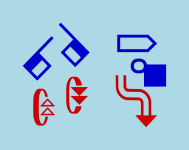

# @sutton-signwriting/font-db
[](https://gitter.im/sutton-signwriting/community?utm_source=badge&utm_medium=badge&utm_campaign=pr-badge&utm_content=badge)
[](https://www.npmjs.com/package/@sutton-signwriting/font-db)
[](https://npm-stat.com/charts.html?package=@sutton-signwriting/font-db&from=2019-10-31)



@sutton-signwriting/font-db is a javascript package for node that generates SVG and PNG images for individual symbols, complete signs, and structured text. The package covers the entire set of the International SignWritnig Alphabet 2010 (ISWA 2010).

This package supports both Formal SignWriting in ASCII (FSW) and SignWriting in Unicode (SWU) character sets, along with the style string.  See [draft-slevinski-formal-signwriting](https://tools.ietf.org/id/draft-slevinski-formal-signwriting-09.html) for detailed specification.

> Author: https://SteveSlevinski.me  
> Channel: https://www.youtube.com/channel/UCXu4AXlG0rXFtk_5SzumDow  
> Sponsor: https://www.patreon.com/signwriting  
> Donate: https://paypal.me/signwriting

## Useful links

- GitHub Repo: https://github.com/sutton-signwriting/font-db
- Documentation: https://www.sutton-signwriting.io/font-db/
- Issue Tracker: https://github.com/sutton-signwriting/font-db/issues
- Online Discussion: https://gitter.im/sutton-signwriting/community


## Install in existing NPM package
```
    npm install @sutton-signwriting/font-db
```

## Install Font Database Package as stand-alone
```
    # download package
    git clone https://github.com/sutton-signwriting/font-db.git

    # install dependancies
    cd font-db
    npm install

    # test project
    npm run test
    npm run testit fsw
    npm run testit fsw-symbol-svg

    # create project documentation
    npm run docs

    # start built-in server
    npm run server
```

## Usage

### Using in code
```
    // import entire library
    const fontDb = require('@sutton-signwriting/font-db');

    // import individual module
    const fsw = require('@sutton-signwriting/font-db/fsw');
```

### Using on the command line
```
    # works for script with FSW and SWU, Symbol and Sign, SVG and PNG.

    # output in the terminal
    node fsw/fsw-sign-svg M525x535S2e748483x510S10011501x466S2e704510x500S10019476x475-C

    # save to file
    node fsw/fsw-sign-svg M525x535S2e748483x510S10011501x466S2e704510x500S10019476x475-C output.svg
```

## License
MIT

## SignWriting General Interest
- SignWriting Website: https://signwriting.org/
- Wikipedia page: https://en.wikipedia.org/wiki/SignWriting
- Email Discussion: https://www.signwriting.org/forums/swlist/
- Facebook Group: https://www.facebook.com/groups/SuttonSignWriting/
